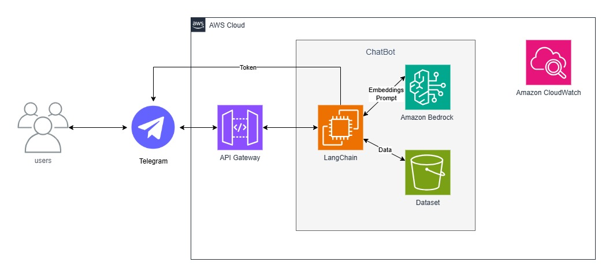

# Avaliação das Sprints 7 e 8 - Programa de Bolsas Compass UOL / AWS - turma janeiro/2025

Avaliação das sétima e oitava sprints do programa de bolsas Compass UOL para formação em Inteligência Artificial para AWS.

***

## Execução (Código Fonte)

Faça um chatbot para consulta de documentos jurídicos. Para tanto, devem ser carregados os documentos indicados e montada uma base em bucket S3. Esta base deve constituir o RAG (Retrieval Augmented Generation) a ser utilizado com o Bedrock. O mecanismo do chatbot deve ser provido pelo LangChain com Chroma e a interface pelo Telegram. O Cloudwatch deve ser utilizado para gravação de log dos dados processados.

**Especificações**:

1. Criar um chatbot com [LangChain](https://www.langchain.com/) fazendo a carga a partir de um S3 contendo dos documentos disponibilizados na pasta [dataset](<./dataset>).
2. Gerar os embeddings com Bedrock e indexar com [Chroma](https://python.langchain.com/docs/integrations/vectorstores/chroma/).
3. Utilizar o Bedrock como mecanismo de consulta de dados (retrieval).
4. Expor o chatbot no Telegram.

* Exemplos completos:
  * [Quick Start on RAG (Retrieval-Augmented Generation) for Q&A using AWS Bedrock, ChromaDB, and LangChain](https://medium.com/@thallyscostalat/quick-start-on-rag-retrieval-augmented-generation-for-q-a-using-aws-bedrock-chromadb-and-64c35d966188)
  * [RAG Application using AWS Bedrock and LangChain](https://dev.to/aws-builders/rag-application-using-aws-bedrock-and-langchain-140b)
  * [How to Build a Locally Hosted Chatbot w/ Bedrock and More!](https://www.serverlessguru.com/blog/how-to-build-a-locally-hosted-chatbot-with-amazon-bedrock-langchain-and-streamlit)
  * [How to Build High-Accuracy Serverless RAG Using Amazon Bedrock and Kendra on AWS](https://medium.com/@zekaouinoureddine/how-to-build-high-accuracy-serverless-rag-using-amazon-bedrock-and-kendra-on-aws-9ec9681e4e9b)

* Dica 1: usar o [PyPDFLoader](https://python.langchain.com/docs/how_to/document_loader_pdf/) do LangChain.
* Dica 2: para expor no Telegram olhar o artigo [How to Build a Telegram Bot in 5 Simple Steps](https://dev.to/catheryn/how-to-build-a-telegram-bot-in-5-simple-steps-4964)

### Arquitetura Básica

***

## O que será avaliado?

* Uso de Python no projeto;
* Aplicação dos recursos AWS solicitados;
* Execução com as ferramentas indicadas (LangChain, Chroma, Telegram);
* Entendimento do chatbot e o que ele soluciona;
* Projeto em produção na cloud AWS;
* Uso do CloudWatch para gravar os logs dos resultados;
* Seguir as atividades na ordem proposta;
* Subir códigos no git ao longo do desenvolvimento;
* Organização geral do código fonte:
  * Estrutura de pastas;
  * Estrutura da lógica de negócio;
  * Divisão de responsabilidades em arquivos/pastas distintos;
  * Otimização do código fonte (evitar duplicações de código);
* Objetividade do README.md;
* Modelo de organização da equipe para o desenvolvimento do projeto.

***

## Entrega

* **O trabalho deve ser feito em grupos de três ou quatro pessoas**;
  * **Não devem ocorrer repetições das equipes constituídas na sprint anterior**;
* Criar uma branch no repositório com o formato grupo-número (exemplo: grupo-1);
* Subir o trabalho na branch da equipe com um README.md:
  * documentar detalhes sobre como a avaliação foi desenvolvida;
  * relatar dificuldades conhecidas;
  * descrever como utilizar o sistema;
  * fornecer a URL para acesso ao chatbot;
* 🔨 Disponibilizar o código fonte desenvolvido (observar estruturas de pastas);
* O prazo de entrega é até às 14h do dia 12/05/2025 no repositório do github (<https://github.com/Compass-pb-aws-2025-JANEIRO/sprints-7-8-pb-aws-janeiro>).

*** 

## Apresentação

* A coordenação do programa de bolsas irá agendar a apresentação das equipes.
* Cada equipe terá 15 minutos para apresentar seu readme, código e demonstração do funcionamento da aplicação.
* Na apresentação haverá ao menos uma pessoa da equipe do Programa de Bolsas para acompanhamento.
* A apresentação será gravada para que os instrutores possam avaliar posteriormente.
* Após assistir a gravação da apresentação haverão instrutores que darão o feedback técnico.
* Após todas as apresentações a coordenação também fornecerá o feedback comportamental.

***
